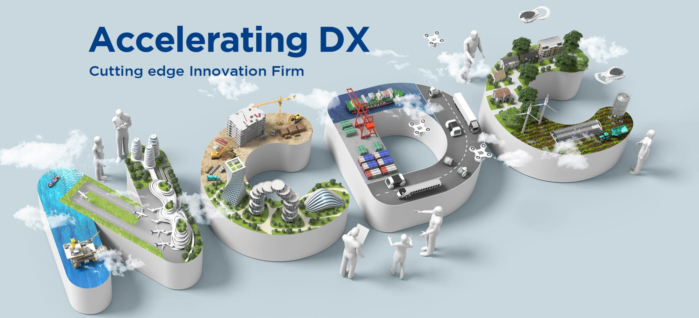
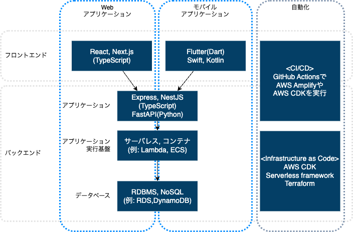
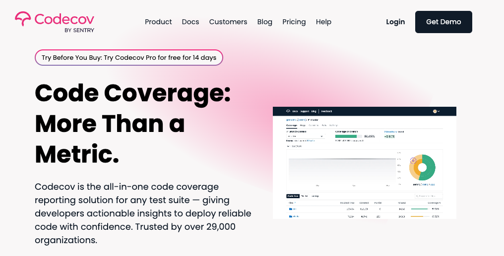
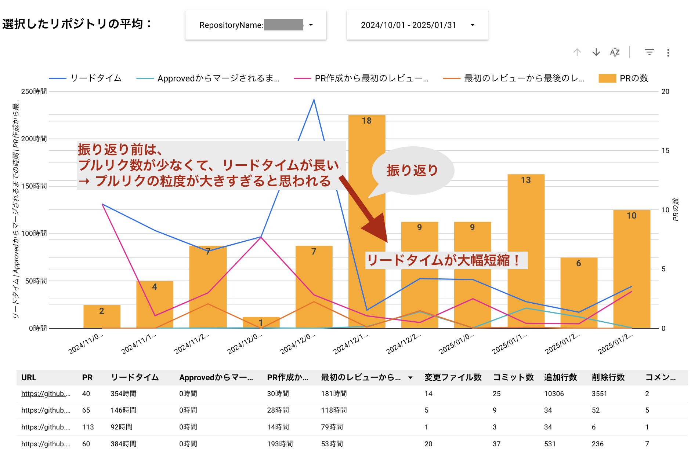
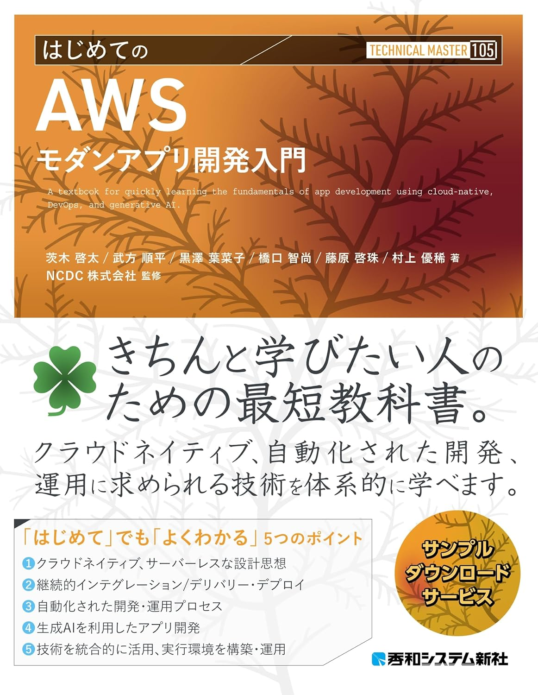
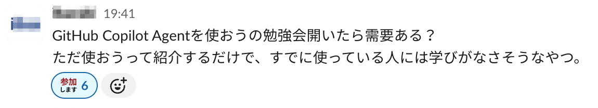
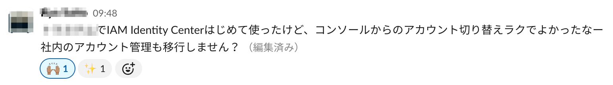
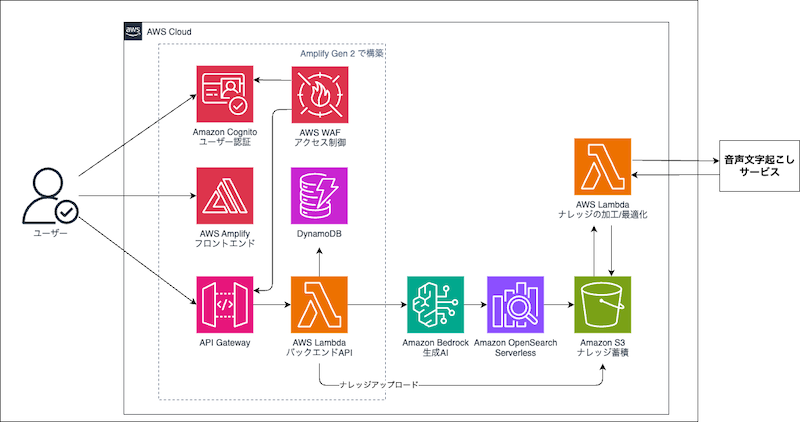
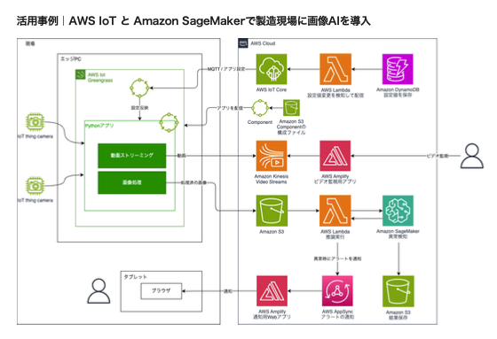

# **[今すぐ採用エントリー](https://ncdc.co.jp/recruit/entry/)**

↑ 採用エントリーはこちら

----

# NCDCのエンジニア採用に応募しませんか

NCDCでは年間を通してエンジニアチームの採用を行っています。

- [**今すぐ採用エントリー**](#今すぐ採用エントリー)
- [NCDCのエンジニア採用に応募しませんか](#ncdcのエンジニア採用に応募しませんか)
  - [NCDCの紹介](#ncdcの紹介)
  - [NCDCのエンジニアチームの特徴](#ncdcのエンジニアチームの特徴)
    - [自分たちで開発プロセス、使う技術を選択する](#自分たちで開発プロセス使う技術を選択する)
    - [生産性や品質を上げるためのツールの導入](#生産性や品質を上げるためのツールの導入)
      - [生成AIの開発への活用](#生成aiの開発への活用)
      - [テスト文化](#テスト文化)
      - [その他の取り組み](#その他の取り組み)
    - [サービスの企画段階から参画できる](#サービスの企画段階から参画できる)
    - [リモートワークなどエンジニアが働きやすい制度](#リモートワークなどエンジニアが働きやすい制度)
    - [活発な技術交流とナレッジ共有](#活発な技術交流とナレッジ共有)
  - [どんなことをやっているか](#どんなことをやっているか)
    - [Webサービス、モバイルアプリ開発](#webサービスモバイルアプリ開発)
    - [生成AIソリューション](#生成aiソリューション)
    - [IoT、M2M](#iotm2m)
    - [アーキテクチャ系](#アーキテクチャ系)
    - [AI/ML、データ分析](#aimlデータ分析)
    - [NCDCがやっていることまとめ](#ncdcがやっていることまとめ)
  - [採用プロセス](#採用プロセス)
  - [応募方法](#応募方法)

## NCDCの紹介

[NCDC](https://ncdc.co.jp/) は、「デザインとテクノロジーの力でビジネスを成功に導く」をキーワードにクライアントの新規サービスの企画からデザイン、システム開発までを一元的に行う、日本発のデジタルイノベーションファームです。

デザインシンキングやUXデザイン、アジャイル開発などプロセスや方法論を活用してクライアントのデジタルビジネス推進を支援します。

## NCDCのエンジニアチームの特徴

NCDCにはコンサル、デザイナー、セールス＆マーケなどのチームがありますが、会社全体の約半分のメンバーがエンジニアチームにいます。
チームの垣根は低く、プロジェクトやプロダクトのチームにはいろいろなプロフェッショナルが一体となって進めています。また、複数のチームに所属している人もいます。

2025年度のエンジニアチームの活動を別ページでまとめていますので、気になる方はそちらもご覧ください。

[2025年度のNCDCエンジニアチームの活動紹介](./team-activity-2025.md)

( [2024年度](./team-activity-2024.md) )

### 自分たちで開発プロセス、使う技術を選択する

開発プロセスや技術の選択に対して、自分たちの裁量が大きいです。

お客様は事業部門の方が多く、使用技術の選定はNCDCに委ねていただけることがほとんどです。もちろん選択の自由には責任も伴います。「なんとなく流行っているから」では技術を選べませんし、選んだ以上はきちんとユーザーが使えるものにする（もしくは別の技術への切り替えを判断する）必要があります。

プロジェクトごとに技術的な振り返りを確実に実施し、得られた知見を次のプロジェクトに活かす文化が根付いています。この継続的な改善のサイクルにより、より良い技術選定や開発プロセスの最適化を実現しています。

最近では、生成AIに関する技術の選定や導入もエンジニアチームが主導で行っています。例えば、GitHub CopilotやCursorなどのコーディング支援ツールの導入を進めるとともに、社内での活用方法やベストプラクティスの共有も積極的に行っています。
エンジニアチームが主体的に検証や導入を行うことで、2026年2月時点で、エンジニアのほぼ全員に加え、デザイナーやコンサルなどの他の職種のメンバーも利用できる環境が整っています。

また、生成AIに限らず、NCDCの強みとして、モダンな開発プロセスや、技術を使ってサービスを実現することが挙げられます。そのため、新しい技術を積極的に採用しています。
NCDCで採用している技術スタックはフロントエンド、バックエンドともTypeScriptを採用しており、インフラはAWSをほとんどのケースで採用しています。

その他、モバイルアプリやCI/CDなどについてもまとめた記事がありますので、気になる方は読んでみてください。

[NCDCの技術スタック](https://ncdc.co.jp/columns/7187/)

### 生産性や品質を上げるためのツールの導入

#### 生成AIの開発への活用

前述の通り、エンジニアの生産性を高めるために開発エージェントを積極的に導入しています。
開発では、GitHub Copilot、Cursor、Claude Code、Kiro、Antigravity などを希望者が利用できます。
また、全社的にGeminiを導入しています。

これらのツールは、コーディング支援やコード補完、リファクタリング、テストコードの生成、タスク管理、ドキュメンテーション、コードレビューなどの開発のあらゆる場面で活用されており、開発効率の向上に大きく貢献しています。

新しいツールについても、都度、社内のセキュリティガイドラインに従って評価・導入を進めています。

#### テスト文化

NCDCではテストコードを積極的に書く取り組みをしています。

テストのカバレッジを見える化するために[Codecov](https://about.codecov.io/)を導入しています。
新規プロジェクトではテストカバレッジの導入率100%を達成しており、チーム全体でテストを書く文化が定着しています。

#### その他の取り組み

エンジニアチームでは開発の生産性と品質を高めるため、以下のような取り組みを行っています。

- プルリクエストのリードタイム可視化ツールの開発と運用
- 各チーム（フロントエンド、バックエンド、インフラ）でのテンプレートやガイドラインの整備
- 新規プロジェクトへのテストカバレッジ計測の100%導入と定期的な振り返り

プルリクエストのリードタイム可視化ツールは、AWSのLambdaとGoogleのLookerを使って比較的短期間で開発しました。このツールを使って各プロジェクトで開発の振り返りを行い、日々の生産性の向上につなげています。

### サービスの企画段階から参画できる

コードを書く時に、「この技術を使ったらもっとこんな機能を提供できるのに」とか「なんのためにこの機能があるのかわからない」と感じたことはないでしょうか。

NCDCの強みは、サービスの企画、デザイン、ソフトウェア開発を全部自社でできることです。そのため、エンジニアもサービスの企画段階から入って、技術的な側面からビジネス側の人たちと一緒にサービスを作り上げていきます。

### リモートワークなどエンジニアが働きやすい制度

NCDCは創業以来リモートワークを採用しています。そのため、自社のオフィスに出勤するという考え方はありません。

一方、お客様先に行ってワークショップを実施したり、スプリントミーティングをやったりというのは積極的に行っていますので、週に１、２回はミーティングに出かけることがあります。（実際には、新型コロナの流行以降はお客様とのミーティングもリモートが多くなっています）

10年以上リモートワークを採用していることもあり、リモートでも良いアウトプットが出せる仕組みや、コミュニケーションのとり方は工夫しています。

また、時間の使い方の裁量は大きいと思いますし、社内の事務作業などは極力軽量化されています。
お客様と話している時間より社内のマネージャーの承認を取る方に時間がかかる、というような時間のストレスはまずありません。

PCはエンジニア以外も含めて全員 MacBook Pro が貸与されますので、開発環境周りのストレスも少ないと思います。

### 活発な技術交流とナレッジ共有

チーム全体で技術力向上とナレッジ共有に力を入れています。

- **社内勉強会**: 年間40回以上開催。取り組みの詳細は[振り返りで続ける勉強会](https://speakerdeck.com/rsogo/retrospective-driven-study-workshop-ncdc)にまとめています。
- **社外勉強会**: AWS、ReactのLT会をほぼ毎月開催。主に[connpass](https://ncdc-dev.connpass.com/)にて一般公開しています。
  - 2025年度は、1年間で11回開催しました。
- **技術記事**: ZennやQiitaで年間150件以上の記事を公開。[NCDCのZenn記事一覧](https://zenn.dev/p/ncdc)
- **コードレビュー文化**: PRレビューやペアプログラミングを通じて、より良いコードと設計を追求します。
- **書籍出版**: 2025年11月、エンジニアの有志が「[TECHNICAL MASTER はじめてのAWSモダンアプリ開発入門](https://www.amazon.co.jp/dp/4798075299)」を出版しました。

  

また、エンジニアメンバーは外部の勉強会への参加も積極的で、最新技術のキャッチアップや外部コミュニティとの交流を大切にしています。

社内の技術的なコミュニケーションも活発で、勉強会は誰でも思い立ったら開催できますし、業務改善も気楽に提案できる雰囲気があります。

## どんなことをやっているか

開発しているソフトウェアは次のようなものです。

### Webサービス、モバイルアプリ開発

- コンシューマ向け、企業向けを問わずWebサービスや、アプリの企画から開発

新規のサービスが多いのが大きな特徴で、反対に、ゲームの開発や企業の基幹システムの開発はあまりやっていません。

### 生成AIソリューション

- 生成AIを活用したアプリケーション開発
- ChatGPTやClaude等を用いたビジネスソリューションの設計・実装
- 生成AIを活用したRAGや業務効率化ツールの開発
- 自社プロダクトの生成AIエージェントの開発

例えば、AWSのモダンなサービスを活用して、生成AIを使ったRAGのアプリを短期間で開発し、お客様の業務効率化に貢献しました。

### IoT、M2M

- 製造や建設の現場で各種センサーデータとクラウドで連携するIoTのサービス
- 楽器とBluetoothで連携して新しいユーザー体験を提供するモバイルアプリ
- リモートのカメラの映像をクラウドで処理して、物体検出や画像解析を行うシステム

クラウドを活用したIoTの事例として、Webカメラからの情報をリアルタイムでクラウドに送信し、画像処理や分析を行うシステムを開発しました。

### アーキテクチャ系

- 大規模なWebサービスのサーバレスでの構築
- 大規模なIoTのシステムでメッセージング層、アプリケーション層などのアーキテクチャの設計
- マイクロサービスアーキテクチャの設計と実装

### AI/ML、データ分析

- 生成AIとコンピュータビジョンを組み合わせたハイブリッドソリューションの開発
- 動画からの物体検出モデルの開発
- IoTで各種センサーから収集したデータを元に、ある数値に相関関係のあるデータを分析する
- 機械学習モデルの実運用とMLOpsの実践

### NCDCがやっていることまとめ

実際に市場に出るプロダクトももちろん開発しますし、新規性の高いものはPoCとしてプロトタイプの開発なども行っています。
NCDCの強みは、サービスの企画フェーズでお客様やデザイナーと一緒になってサービスを考えるところから、ソフトウェアを開発してプロダクトやサービスという実際に価値を生むところまでトータルで提供できるところです。

NCDCの業務内容の特徴として、エンドユーザーとの直接契約がほとんどで、お客様のオフィスに常駐する仕事はほぼありません。

## 採用プロセス

基本的には以下のようなプロセスで進みます。決まったプロセスとは別に、例えば、同い年くらいの同じ職種の人と話してみたいなどご希望があれば柔軟に対応しています。

1. 面談

   せっかく転職されるので、ご自分のやりたいことや考え方と転職先がマッチしているのかが重要だと思います。面談では主にNCDCのことを知っていただくのを目的としていますので、遠慮なくいろいろ聞いてください。

2. 技術課題・エンジニア面接

   技術課題はフロントエンド、バックエンド、インフラなど得意な領域で受けていただくことが可能です。コードが書けるだけではなく、設計の考え方があるのか、使っているフレームワークの思想にあった書き方をしているのか、変更しやすい作りになっているのかなどの観点で確認させていただきます。面接の際に、どうしてこの設計にしたのかなどをお聞きするので、補足してもらえたらありがたいです。またGitHubなどで公開されている方はそちらで代替できる可能性がありますので、その旨お伝えください。

3. 最終面接

採用プロセスについては、下記の記事も参考になると思うので、ご覧ください。
[現役採用担当者が明かすエンジニア採用試験突破マニュアル](https://ncdc.co.jp/columns/6955/)

## 応募方法

[採用エントリーはこちら](https://ncdc.co.jp/recruit/entry/)

または、下記のメールアドレス、またはお問い合わせフォームでご連絡ください。
CTOが直接確認して、ご連絡致します。

- [NCDC企業Webサイト](https://ncdc.co.jp/)
- [NCDC採用サイト](https://ncdc.recruit-site.biz/)
- [採用担当へメール](mailto:hr@ncdc.co.jp)
