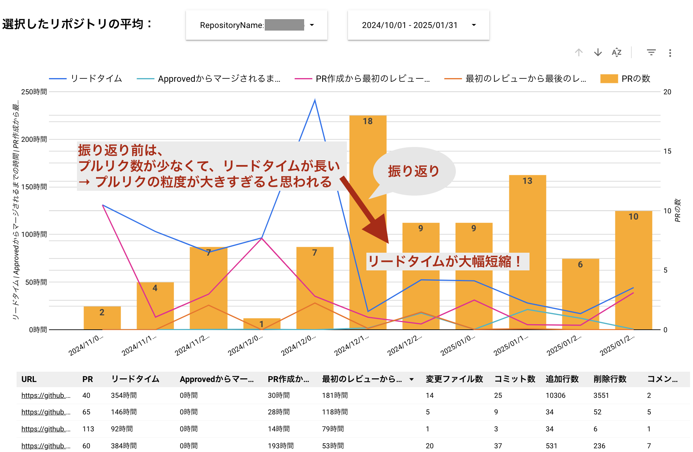

# 2024年度のNCDCエンジニアチームの活動紹介

2024年度に案件以外で実施したNCDCエンジニアチームの活動の一部を紹介します。

## 技術系のアウトプット

### 技術記事

社内コラムやZennに技術記事を投稿し、エンジニアリングの知見を共有しました。
その数、1年で130件以上！

- [NCDCのZenn記事一覧](https://zenn.dev/p/ncdc)
- [NCDCの社内コラム](https://ncdc.co.jp/columns/)

### セミナー登壇

自社主催のセミナーに登壇し、技術情報を発信しました。

- [NCDCのセミナー一覧](https://ncdc.co.jp/seminar/)

### LT会主催

NCDC社外にも公開するLT会を主催し、エンジニア同士の情報交換を行いました。2024年度は、1年間で8回開催しました。

- [NCDCエンジニア主催のイベント一覧(connpass)](https://ncdc-dev.connpass.com)

### 社内勉強会

定期的または不定期に社内勉強会を開催し、技術力を高めました。
以下に2024年度に開催した勉強会の一例を紹介します。

- Type Challengesもくもく会
- AWS CDK勉強会
- プリンシプルオブプログラミング輪読会
- 生成AI勉強会
- PR(プルリクエスト)勉強会
- TypeScript大会
- CPUから並列・並行処理までを理解する勉強会
- git内部構造勉強会
- 「振り返り」勉強会
- pep8読み合わせ会
- DDD勉強会
- マルチテナントSaaSアーキテクチャの構築
- GitHub Copilot Agentを使おう
- 帳票サービスSaaS共有会
- 「単体テストの考え方/使い方」輪読会

### チームに分かれての活動

エンジニアチーム内で、興味のある分野ごとに別れて、活動を行いました。
2024年に実施した活動の一部を紹介します。

#### AIチャットボットアプリの開発

生成AIを活用したアプリケーション開発を行い、
AWS SummitやIT Weekなどの展示会でデモを行いました。

#### モバイルアプリ開発の技術調査

モバイルアプリ開発における学習や技術調査を行い、
資料化や記事化を行いました。
例えば、[MDMのモバイルアクセシビリティ](https://developer.mozilla.org/en-US/docs/Learn_web_development/Core/Accessibility/Mobile)を読み、[記事を公開](https://zenn.dev/ncdc/articles/71ea91f6523f8f)しました。

#### GitHubのプルリクエストのリードタイム可視化ツールの開発

GitHubのプルリクエストのリードタイムを可視化するツールを開発しました。
これにより、開発の作業効率を把握し、改善に結びつけることができました。
また、エンジニア同士のコミュニケーションを促進する効果もありました。

#### データベース選択の為の性能や特徴の比較

プロジェクトに適したデータベースを選択する為に、
RDBやNoSQLなどのデータベースの性能や特徴を比較し整理しました。

#### React hooksの使い方の理解と共有

実践で使えるよりよいフロントエンドのコードを書くために、React hooksのリファレンスを通して深い理解を得て、チーム内で共有しました。

#### その他

ここまでの活動以外にも、エンジニアチーム内で様々な活動を行いました。

## まとめ

2024年度は、技術系のアウトプットやチームに分かれての活動を通じて、エンジニアリングの知見を高め、チーム全体の技術力向上に取り組みました。
NCDCは、単純な開発作業だけでなく技術的な活動を重視し、エンジニアの成長を支援する環境が整っています。

これらの活動やNCDCに興味を持たれた方は、ぜひ[採用情報](https://ncdc.co.jp/recruit/)もご覧ください。
