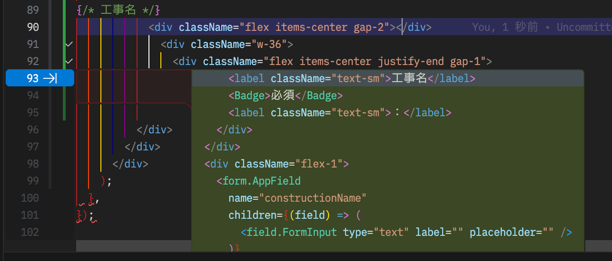
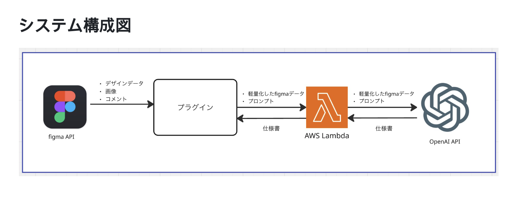
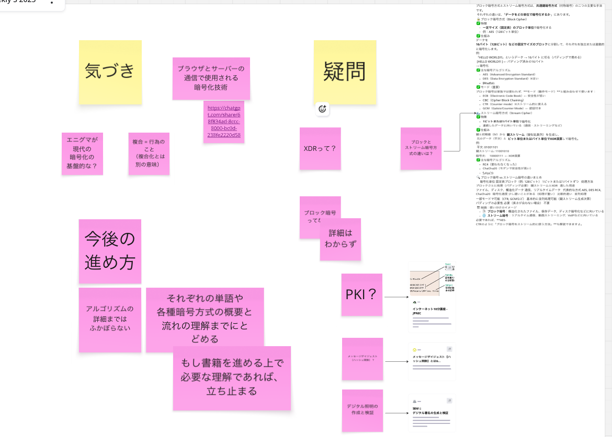
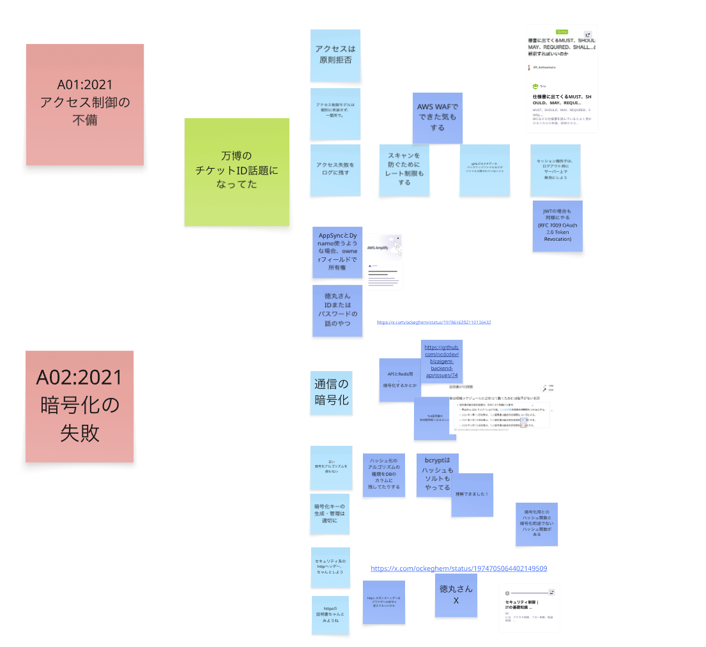

# 2025年度のNCDCエンジニアチームの活動紹介

2025年度に案件以外で実施したNCDCエンジニアチームの活動の一部を紹介します。

## 技術系のアウトプット

### NCDCのエンジニアの有志で、書籍を出版しました！

2025年11月に、NCDCのエンジニアが書いた技術書「TECHNICAL MASTER はじめてのAWSモダンアプリ開発入門」を発売しました。

こちらの書籍は、AWSを活用したモダンなWebアプリケーションの開発に関する入門書になります。
AWS本というとインフラ寄りのイメージが強いですが、こちらの書籍はAWSを活用したフロントエンドやバックエンドの開発にフォーカスしており、実際のプロジェクトでも活かせる内容になっています。

### 技術記事

社内コラムやZennに技術記事を投稿し、エンジニアリングの知見を共有しました。
その数、1年で150件以上！

- [NCDCのZenn記事一覧](https://zenn.dev/p/ncdc)
- [NCDCの社内コラム](https://ncdc.co.jp/columns/)

### セミナー登壇

自社主催のセミナーに登壇し、技術情報を発信しました。

- [NCDCのセミナー一覧](https://ncdc.co.jp/seminar/)

### LT会主催

NCDC社外にも公開するLT会を主催し、エンジニア同士の情報交換を行いました。2025年度は、1年間で11回も開催しました。

- [NCDCエンジニア主催のイベント一覧(connpass)](https://ncdc-dev.connpass.com)

### Zennfes 2025のスポンサー

エンジニア向けの技術知見の共有コミュニティZennのイベント「Zennfes 2025」のスポンサーを務めました。

- [Zennfes 2025](https://zenn.dev/events/zennfes-2025)

### 社内勉強会

定期的または不定期に社内勉強会を開催し、技術力を高めました。
以下に2025年度に開催した勉強会の一例を紹介します。

- テストカバレッジ勉強会
- pep8読み合わせ会
- 書籍「マルチテナントSaaSアーキテクチャの構築」の読み合わせ会
- 文字コード勉強会
- MCPサーバーについての勉強会
- TSサバイバル輪読会
- GraphQL勉強会
- 「安全なウェブサイトの作り方」の勉強会
- スクラムマスター研修 共有会
- AI開発・Tips共有会
- AWS Black Beltを見る会
- AWS SAP勉強会
- Hono + Lambda 入門ハンズオン
- VSCode + GitHub Copilotの基礎
- DI（依存性注入）勉強会
- PRを小さくする勉強会
- パスキー勉強会
- セキュリティ勉強会
- AIエージェントの処理をざっくり説明する会
- AIエージェントの外部連携のOAuth認証をざっくり説明する会
- Figmaツールの共有会
- レイアウト勉強会

### チームに分かれての活動

エンジニアチーム内で、興味のある分野ごとに分かれて、活動を行いました。
2025年に実施した活動の一部を紹介します。

#### AI開発の支援

AI開発の支援を行うチームでは、AI開発に関する情報収集や技術調査を行い、社内で共有しました。
具体的な活動内容としては、以下のようなものがあります。

- Coding Agent調査
  - GitHub Copilot
  - Cursor
  - Cline
  - Windsurf
  - Kiro
  - Codex
  - Antigravity
  - Claude Code
- Coding Agentの社内への導入
  - GitHub Copilot
  - Cursor
  - Antigravity
  - Claude Code
- AI開発勉強会
  - AI開発の知見の共有会
  - AI開発の基礎
- AGENT.md の書き方の検証と共有

このように、NCDCでは、エンジニア発で生成AIに関する情報を収集し、技術調査を行い、社内に導入することができる環境が整っています。

#### 画面仕様書生成Figma Plugin開発

Figma上の画面設計から、画面仕様書を生成するFigma Pluginの開発を行いました。
このプラグインは、NCDCのデザイナーとエンジニアが協力して開発したもので、Figma上の画面設計から、画面仕様書を生成することができます。

#### 書籍「今さら聞けない暗号技術＆認証・認可」輪読会

書籍「[今さら聞けない暗号技術＆認証・認可Web系エンジニア必須のセキュリティ基礎力をUP](https://www.amazon.co.jp/dp/4297133547)」の輪読会を開催しました。

このような勉強会でもAIを積極的に活用しており、章を読み進め、気になった内容・理解が曖昧な箇所をChatGPT等を駆使しながら、深掘り・ディスカッションするような形式で実施しました。

#### OWASP Top10を読んで取るべきセキュリティ対策を考えた

セキュリティ勉強会の一環で、OWASP Top10を読み、Webアプリケーションにおいて取るべきセキュリティ対策を考えました。

#### 「AWS DevOpsAgent vs 人」をテーマとしたイベントをConnpass上で開催

AWSの最新のAIサービスであるAWS DevOpsAgentをテーマとしたイベントをConnpass上で開催しました。

https://ncdc-dev.connpass.com/event/381709/

## まとめ

2025年度は、特に生成AIに関する活動が活発で、積極的に情報収集や技術調査を行い、社内に導入するなどの活動が行われました。
その他にも、技術系のアウトプットやチームに分かれての活動を通じて、エンジニア同士の情報交換や技術力の向上が図られました。
NCDCは、エンジニアが主体的に活動できる環境が整っており、エンジニア同士の交流も盛んです。

これらの活動やNCDCに興味を持たれた方は、ぜひ[採用情報](https://ncdc.co.jp/recruit/)もご覧ください。
